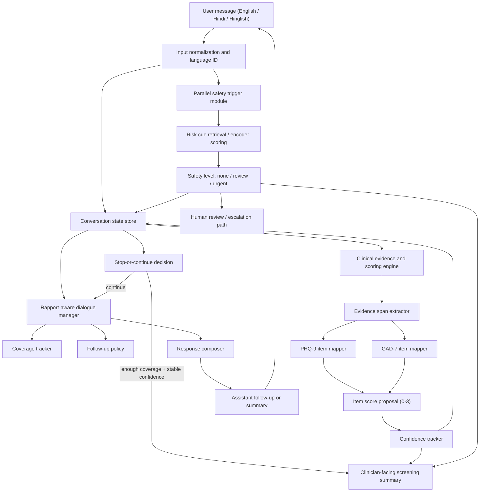
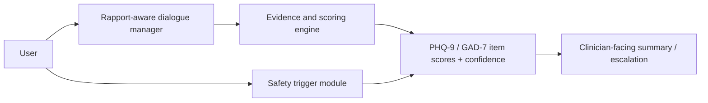

# ManoVarta Architecture Diagram

This file contains two Mermaid diagrams:

1. a detailed research architecture for the report, and
2. a cleaner simplified version for slides.

Both versions keep the same core idea: a multilingual dialogue pipeline with a rapport-aware manager, an evidence-based scoring engine, and a parallel safety module.

## Detailed Version

## Simplified Slide Version

## Component Notes

### 1. Input normalization and language ID

This step standardizes text, handles script variation where possible, and records whether the turn is primarily English, Hindi, or code-mixed. It should be lightweight and auditable.

### 2. Rapport-aware dialogue manager

This module decides how the system should respond conversationally. It keeps track of which symptoms have already been covered, what still needs clarification, and when to stop asking questions. The goal is supportive but bounded dialogue, not free-form counseling.

### 3. Clinical evidence and scoring engine

This module turns raw user statements into structured symptom evidence. It identifies relevant snippets, maps them to PHQ-9 and GAD-7 items, proposes item-level scores, and updates confidence after each turn.

### 4. Confidence tracker

The confidence tracker stores how certain the system is about each item. If confidence is low or contradictory evidence appears, the dialogue manager should prefer follow-up questions. If confidence becomes stable across items, the conversation can close.

### 5. Safety trigger module

This module runs independently of the main scoring path. It monitors for crisis-sensitive language and should be optimized for recall. It can trigger review even if the symptom scoring engine is uncertain.

### 6. Clinician-facing summary

The final output is a structured screening artifact, not a diagnosis. It should include item scores, confidence levels, supporting evidence, unresolved items, and any safety escalation flags.

## Why This Diagram Fits the Proposal

- It shows the three required layers explicitly.
- It makes safety parallel rather than downstream.
- It supports evidence-first scoring instead of hidden one-shot prediction.
- It is simple enough to paste into a Markdown report or slide deck later.
